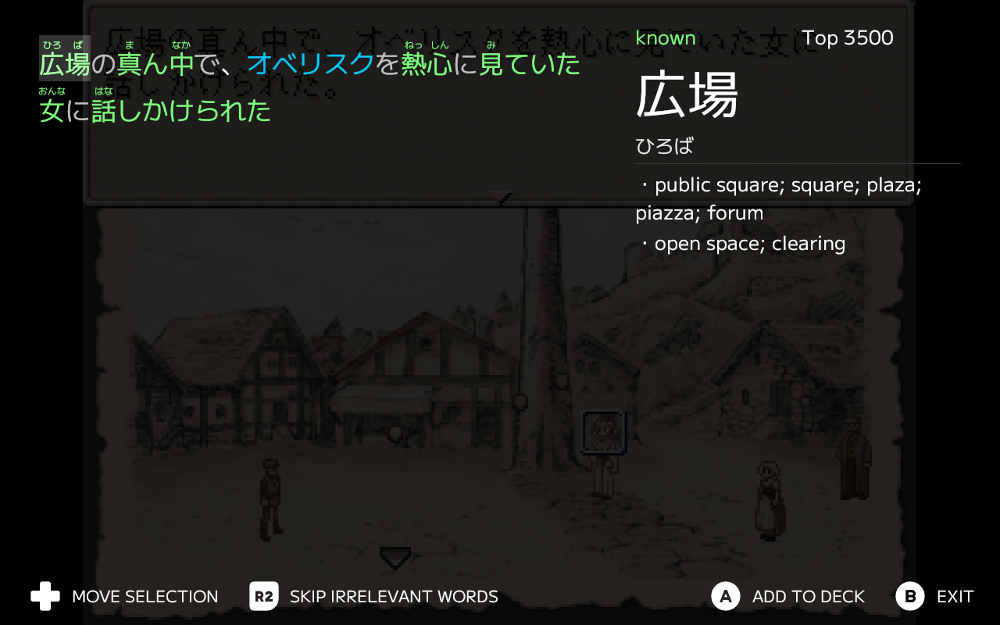

# deckocr

OCR front-end, primarily for the Steam Deck.

**Downloads**: [CLICK HERE](https://github.com/plyfrm/deckocr/releases)

## Features

- Full keyboard/controller navigation
- Can mix and match different OCR, Dictionary and SRS services.

## Supported services

| OCR | Dictionary | SRS |
| :---: | :---: | :---: |
| [OwOCR](https://github.com/AuroraWright/owocr) (websocket) | [jpdb](https://jpdb.io) | [jpdb](https://jpdb.io) |

## Screenshots

## FAQ

### Can I use this on a desktop computer?

Yes, although the user experience is mostly designed for use on handheld gaming computers.
Improving desktop usage is not totally outside the scope of this project, but it is not a priority as of now.

### Will any new services be added?

Local MDict dictionary support as well as AnkiConnect support are both planned so the app can be
used offline. Beyond that, the addition of new services would mostly come down to whether the project
sees contributions.

## Acknowledgements

This project uses assets from the following:

- [Kenney's Input Prompts Assets](https://www.kenney.nl/assets/input-prompts)
- [M+ FONTS](https://github.com/coz-m/MPLUS_FONTS)

And interfaces with the following projects:

- [OwOCR](https://github.com/AuroraWright/owocr)
- [jpdb](https://jpdb.io)
