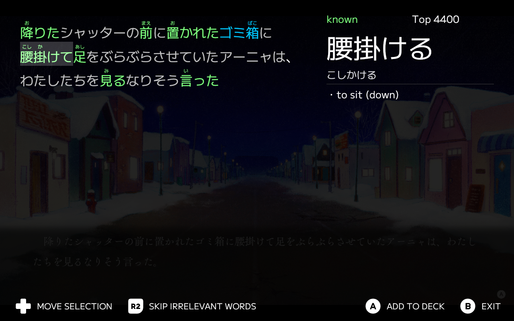

# deckocr

OCR front-end, primarily for the Steam Deck.

## Features

- Full keyboard/controller navigation
- Can mix and match different OCR/dictionary/SRS services

## Currently supported services

OCR:
- OwOCR through websocket

Dictionary:
- jpdb

SRS:
- jpdb

## Screenshots

## FAQ

### Can I use this on a regular desktop computer?

Yes, although the user experience is mostly designed for use on handheld gaming computers.
Improving regular desktop usage is something I would like to do, but it is not a primary goal of the
project and would require a host of new features, so do not expect it anytime soon.

### Will any new services be added?

Local MDict dictionary support as well as AnkiConnect support are both planned so the app can be
used offline. Beyond that, the addition of new services would mostly come down to whether the project
sees contributions or not.

## Acknowledgements

This project uses assets from the following:

- [AL2009man's Gamepad Prompt Asset Pack](https://github.com/AL2009man/Gamepad-Prompt-Asset-Pack)
- [M+ FONTS](https://github.com/coz-m/MPLUS_FONTS)

And interfaces with the following projects:

- [OwOCR](https://github.com/AuroraWright/owocr)
- [jpdb](https://jpdb.io)